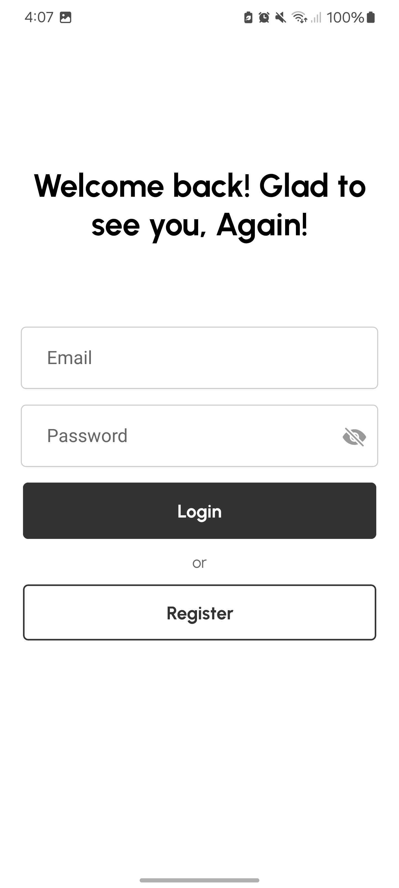
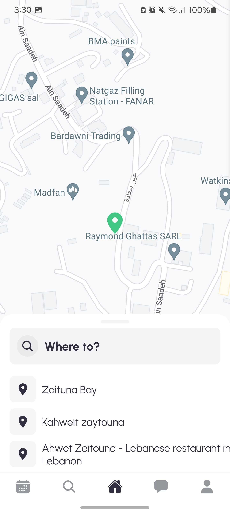
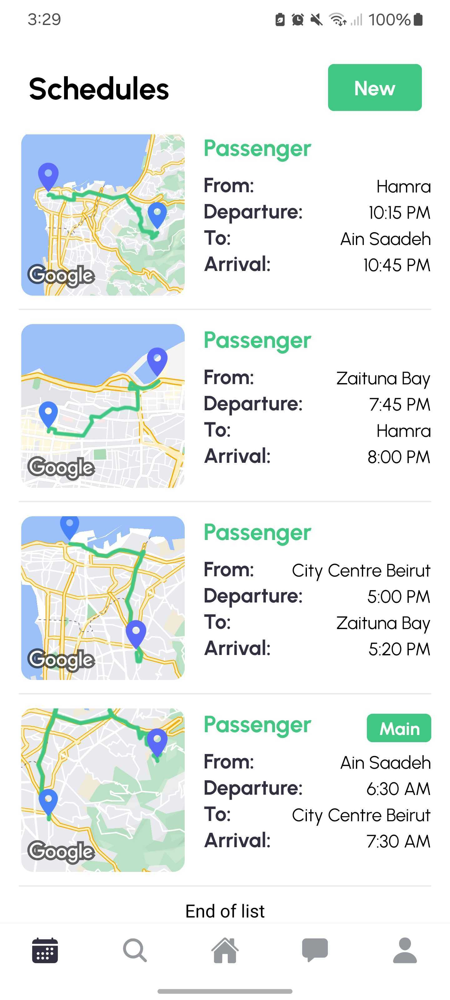

<br><br>

<!-- project philosophy -->


> Carpool Connect is a platform designed to optimize urban mobility by connecting users with matching schedules and routes, and facilitating communication between them.
>
>  The platform allows users to create personalized schedules, automatically find the best route matches based on proximity and travel times, and share rides with others, promoting convenience, cost-saving, and eco-friendly commuting.
>
> The ultimate goal is to reduce commute times, save transportation costs, and promote a greener urban environment.

### User Stories

- As a passenger, I want to find carpooling options that match my schedule and route so that I can commute efficiently and cost-effectively.
  I want to set my schedule details in order to manage my departure and arrival time and location
  I want to view my schedules list and be able to find other riders that match my selection criteria
  I want to be able to contact other riders in order to exchange meeting details and approve the rides

- As a rider, I want to offer rides to users who have similar routes and schedules so that I can reduce my commute costs.
  I want to be able to manage my schedule details in order for other passengers to find me and see my schedule details
  I want to be able to view my schedules list and be able to find other passengers that might match with my commuting schedule
  I want to be able to contact other passengers in order to offer them rides and exchange contact information

- As a ride partner, I want to offer rides to other riders who have similar routes and schedules so we can both reduce our commute costs
  I want to be able to manage my schedule details in order for other riders to find me and see my schedule details
  I want to be able to view my schedules list and be able to find other riders that might match with my commuting schedule
  I want to be able to contact other riders in order to share my rides with them and exchange contact information

<br><br>

<!-- Tech stack -->


### Coffee Express is built using the following technologies:

- This project uses the [Flutter app development framework](https://flutter.dev/). Flutter is a cross-platform hybrid app development platform which allows us to use a single codebase for apps on mobile, desktop, and the web.
- For persistent storage (database), the app uses the [Hive](https://hivedb.dev/) package which allows the app to create a custom storage schema and save it to a local database.
- To send local push notifications, the app uses the [flutter_local_notifications](https://pub.dev/packages/flutter_local_notifications) package which supports Android, iOS, and macOS.
  - 🚨 Currently, notifications aren't working on macOS. This is a known issue that we are working to resolve!
- The app uses the font ["Work Sans"](https://fonts.google.com/specimen/Work+Sans) as its main font, and the design of the app adheres to the material design guidelines.

<br><br>

<!-- UI UX -->


> We designed Carpool Connect using wireframes and mockups, iterating on the design until we reached the ideal layout for easy navigation and a seamless user experience.

- Project Figma design [figma](https://www.figma.com/design/6up6johu37cvuuxxrolCZ7/Carpool-Connect?node-id=43-376&t=IqZBGPF3xN6uBLip-1)

### Mockups

| Login screen                            | Home Screen                           | Schedules Screen                      |
| --------------------------------------- | ------------------------------------- | ------------------------------------- |
|  |  |  |

<br><br>

<!-- Database Design -->


### Architecting Data Excellence: Innovative Database Design Strategies:

- Insert ER Diagram here

<br><br>

<!-- Implementation -->


### User Screens (Mobile)

| Login screen                              | Register screen                         | Landing screen                          | Loading screen                          |
| ----------------------------------------- | --------------------------------------- | --------------------------------------- | --------------------------------------- |
|  |  |  |  |
| Home screen                               | Menu Screen                             | Order Screen                            | Checkout Screen                         |
|  |  |  |  |

### Admin Screens (Web)

| Login screen                            | Register screen                       | Landing screen                        |
| --------------------------------------- | ------------------------------------- | ------------------------------------- |
|  |  |  |
| Home screen                             | Menu Screen                           | Order Screen                          |
|  |  |  |

<br><br>

<!-- Prompt Engineering -->


### Mastering AI Interaction: Unveiling the Power of Prompt Engineering:

- This project uses advanced prompt engineering techniques to optimize the interaction with natural language processing models. By skillfully crafting input instructions, we tailor the behavior of the models to achieve precise and efficient language understanding and generation for various tasks and preferences.

<br><br>

<!-- AWS Deployment -->


### Efficient AI Deployment: Unleashing the Potential with AWS Integration:

- This project leverages AWS deployment strategies to seamlessly integrate and deploy natural language processing models. With a focus on scalability, reliability, and performance, we ensure that AI applications powered by these models deliver robust and responsive solutions for diverse use cases.

<br><br>

<!-- Unit Testing -->


### Precision in Development: Harnessing the Power of Unit Testing:

- This project employs rigorous unit testing methodologies to ensure the reliability and accuracy of code components. By systematically evaluating individual units of the software, we guarantee a robust foundation, identifying and addressing potential issues early in the development process.

<br><br>

<!-- How to run -->


> To set up Coffee Express locally, follow these steps:

### Prerequisites

This is an example of how to list things you need to use the software and how to install them.

- npm
  ```sh
  npm install npm@latest -g
  ```

### Installation

_Below is an example of how you can instruct your audience on installing and setting up your app. This template doesn't rely on any external dependencies or services._

1. Get a free API Key at [example](https://example.com)
2. Clone the repo
   git clone [github](https://github.com/your_username_/Project-Name.git)
3. Install NPM packages
   ```sh
   npm install
   ```
4. Enter your API in `config.js`
   ```js
   const API_KEY = "ENTER YOUR API";
   ```

Now, you should be able to run Coffee Express locally and explore its features.
