<br><br>

<!-- project philosophy -->


> Carpool Connect is a platform designed to optimize urban mobility by connecting users with matching schedules and routes, and facilitating communication between them.
>
>  The platform allows users to create personalized schedules, automatically find the best route matches based on proximity and travel times, and share rides with others, promoting convenience, cost-saving, and eco-friendly commuting.
>
> The ultimate goal is to reduce commute times, save transportation costs, and promote a greener urban environment.

### User Stories

#### Passenger
- I want to find carpooling options that match my schedule and route so that I can commute efficiently and cost-effectively.
- I want to set my schedule details in order to manage my departure and arrival time and location
- I want to be able to to find other riders that match my selection criteria, and contact them in order approve the rides

#### Rider
- I want to offer rides to users who have similar routes and schedules so that I can reduce my commute costs.
- I want to be able to manage my schedule details in order for other passengers to find me and see my schedule details.
- I want to be able to view my schedules list and be able to find other passengers that might match with my commuting schedule.

#### Partner
- I want to offer rides to other riders who have similar routes and schedules so we can both reduce our commute costs
- I want to be able to view and manage my schedule details in order for other riders to find me and see my schedule details
- I want to be able to view my schedules list and be able to find other riders that might match with my commuting schedule and contact them

<br><br>

<!-- Tech stack -->


### Carpool Connect is built using the following technologies:

- This project uses the [Expo](https://expo.dev/) app development framework. Expo is a cross-platform hybrid app development framework for React Native, which allows us to use a single codebase for apps on mobile, desktop, and the web.
- For persistent storage (database), the app uses the [Prisma](https://prisma.io//) package which allows the app to create a custom storage schema and save it to a local database.
- The app uses the font [Urbanist](https://fonts.google.com/specimen/Urbanist) as its main font, and the design of the app adheres to the material design guidelines.

<br><br>

<!-- UI UX -->


> We designed Carpool Connect using wireframes and mockups, iterating on the design until we reached the ideal layout for easy navigation and a seamless user experience.

- Project Figma design [figma](https://www.figma.com/design/6up6johu37cvuuxxrolCZ7/Carpool-Connect?node-id=43-376&t=IqZBGPF3xN6uBLip-1)

### Mockups

| Welcome screen                            | Home Screen                           | Schedules Screen                      |
| --------------------------------------- | ------------------------------------- | ------------------------------------- |
| 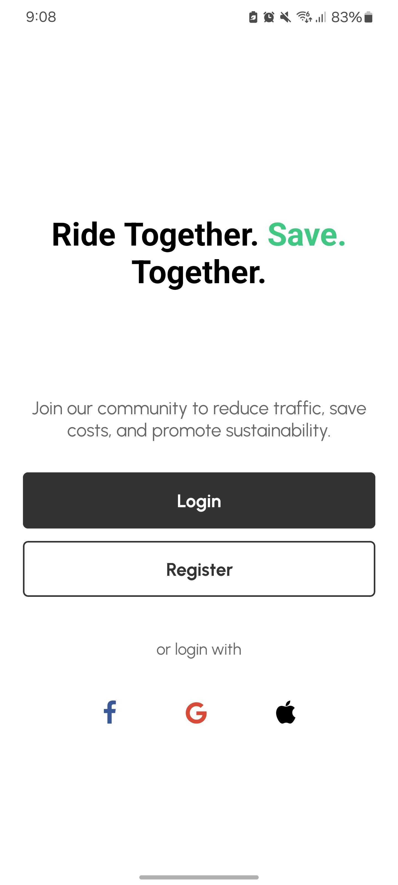 |  |  |

<br><br>

<!-- Database Design -->


### Architecting Data Excellence: Innovative Database Design Strategies:

- [ERD Link on DBDiagram](https://dbdiagram.io/d/Carpool-Connect-66d7b85feef7e08f0e9a5b64)

<br><br>

<!-- Implementation -->


### User Screens (Mobile)

| Welcome screen                            | Login screen                            | Register screen                         | 
| ----------------------------------------- | --------------------------------------- | --------------------------------------- |
|  | 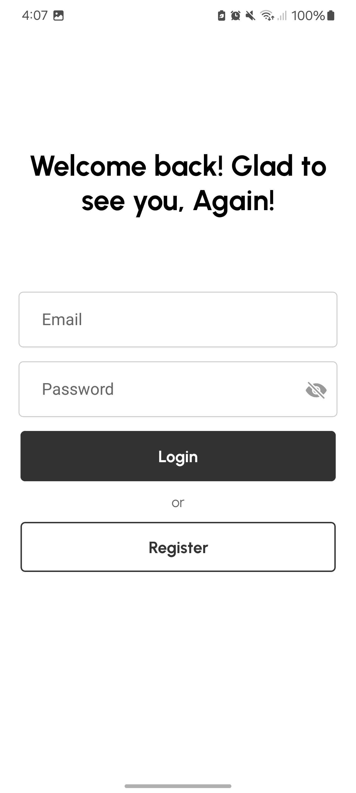 | 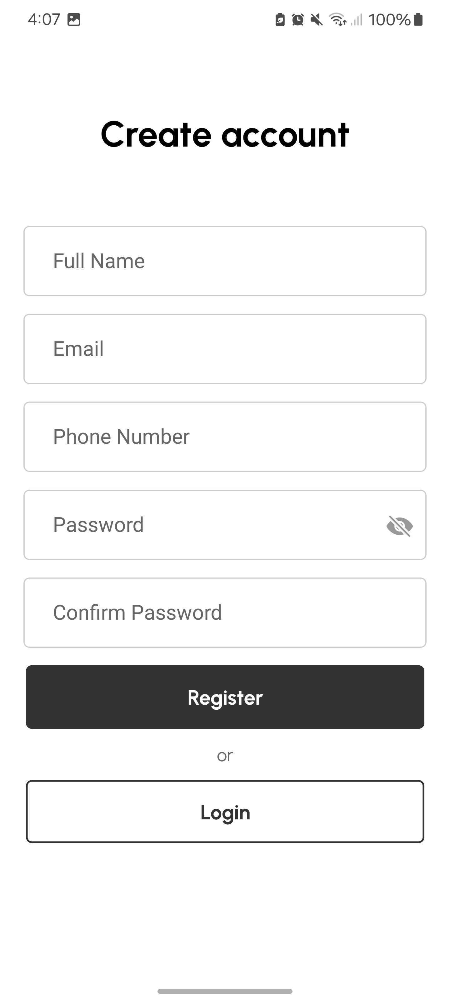|

| Home screen                               | Location Search screen                  | Location Selection screen               |
| ----------------------------------------- | --------------------------------------- | --------------------------------------- |
| 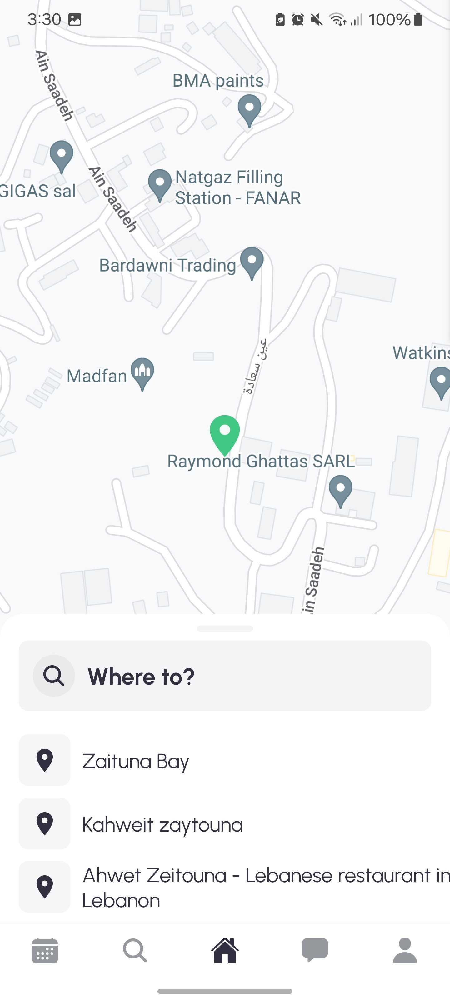    | 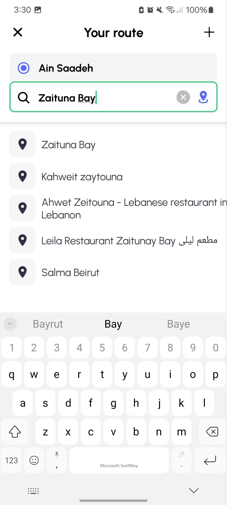  | 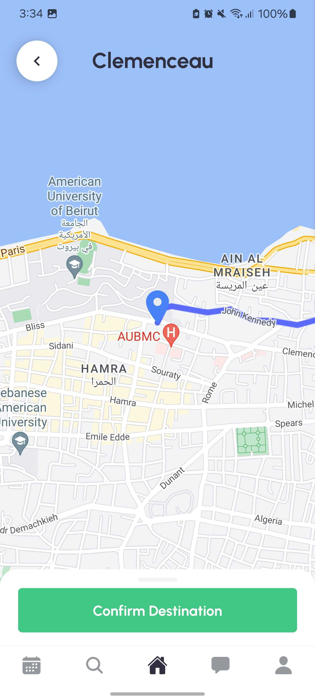|

| Schedule Options screen                   | User Schedules screen                   | Schedules Details screen                |
| ----------------------------------------- | --------------------------------------- | --------------------------------------- |
| 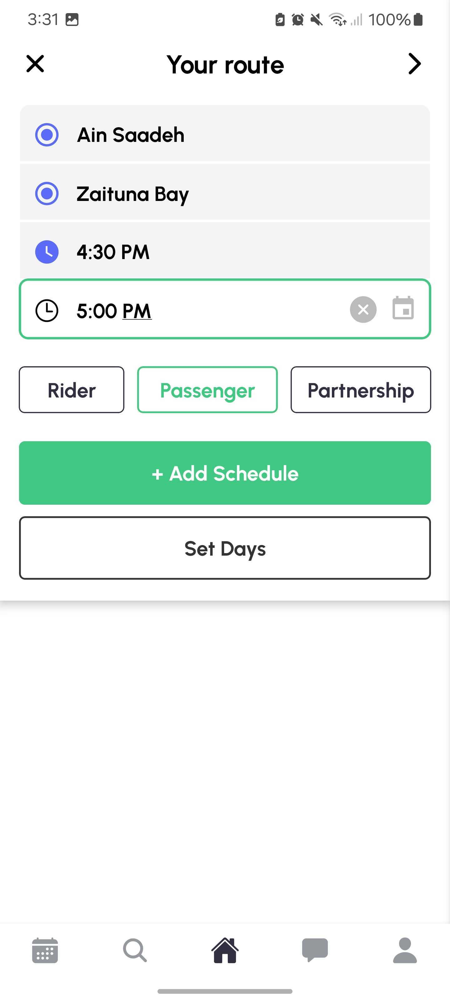 | 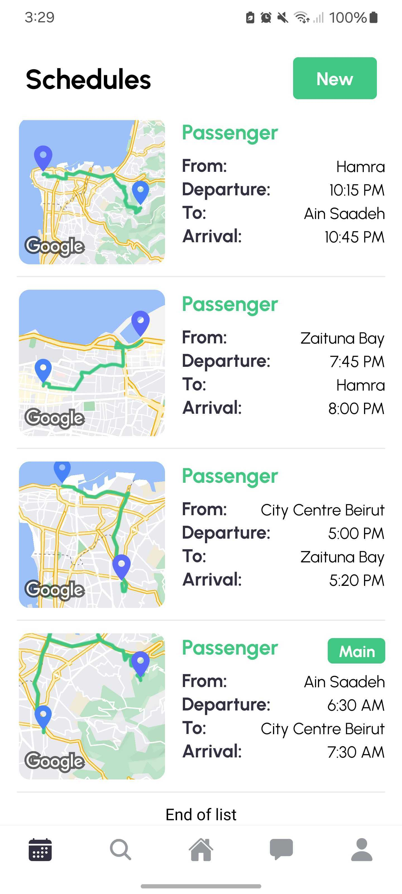 | 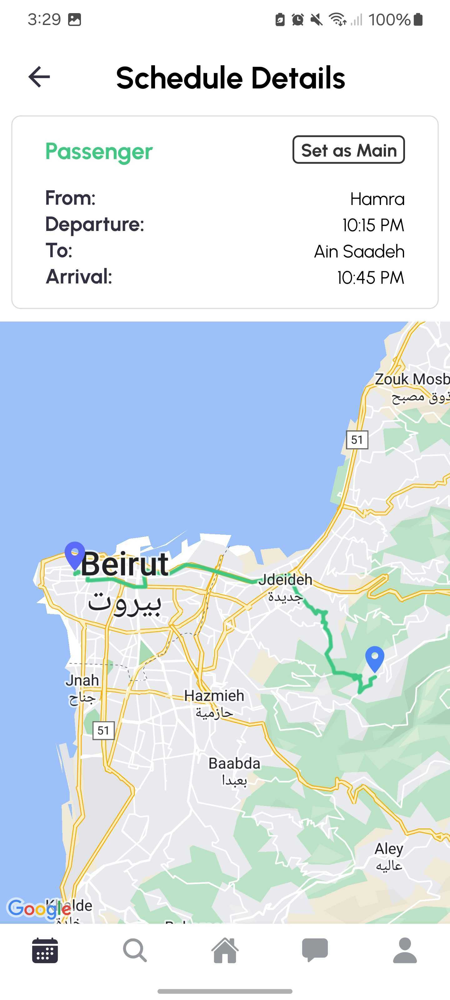 |

| Explore screen                            | Filter Search screen                    | User Schedules screen                   |
| ----------------------------------------- | --------------------------------------- | --------------------------------------- |
| 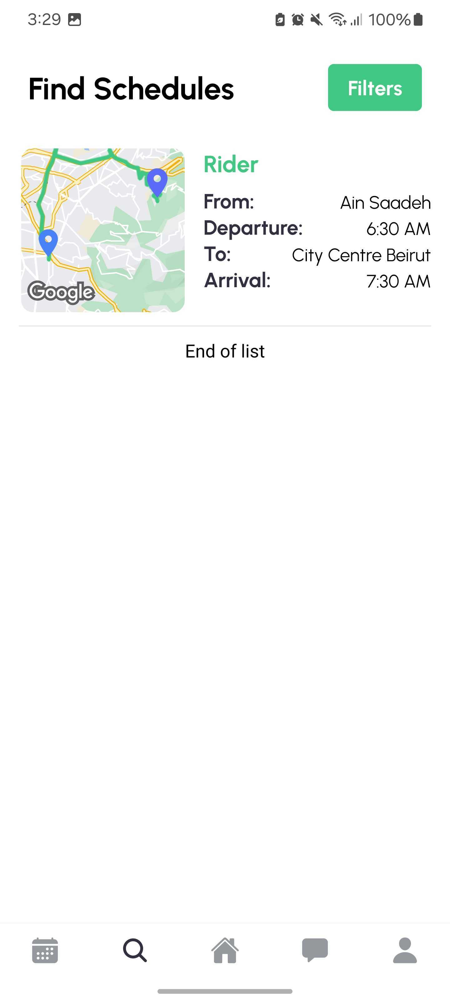 | 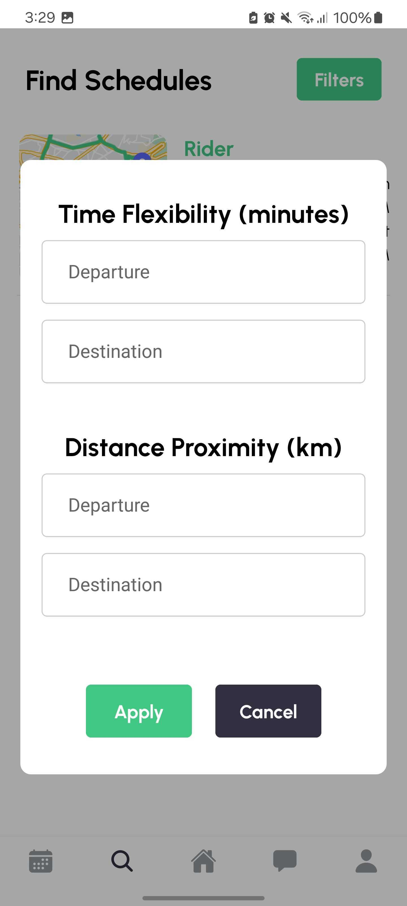  | 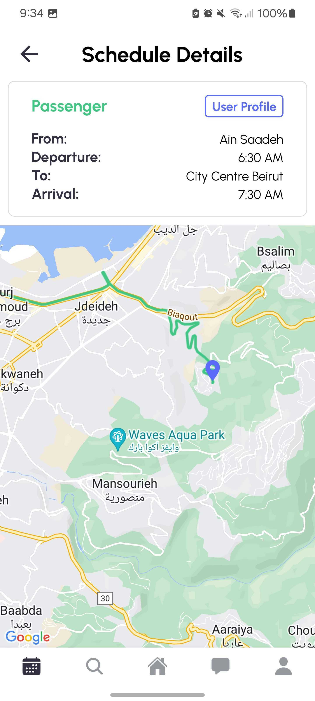 |

<br><br>

<!-- Prompt Engineering -->


### Mastering AI Interaction: Unveiling the Power of Prompt Engineering:

- This project uses advanced prompt engineering techniques to optimize the interaction with natural language processing models. By skillfully crafting input instructions, we tailor the behavior of the models to achieve precise and efficient language understanding and generation for various tasks and preferences.

<br><br>

<!-- AWS Deployment -->


### Efficient AI Deployment: Unleashing the Potential with AWS Integration:

- This project leverages AWS deployment strategies to seamlessly integrate and deploy natural language processing models. With a focus on scalability, reliability, and performance, we ensure that AI applications powered by these models deliver robust and responsive solutions for diverse use cases.
  
|  AWS Infrastructure Diagram |
| ----------------------------------------- |
|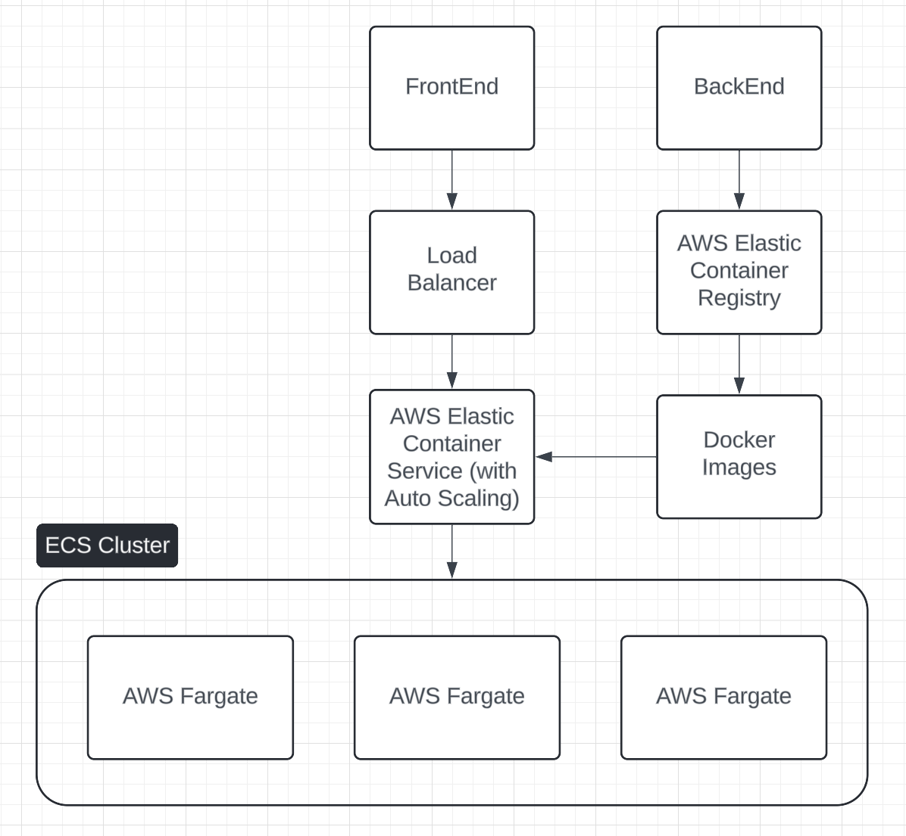 |

| Register User                              | Fetch User Schedules                         |
| ------------------------------------------ | -------------------------------------------- |
| 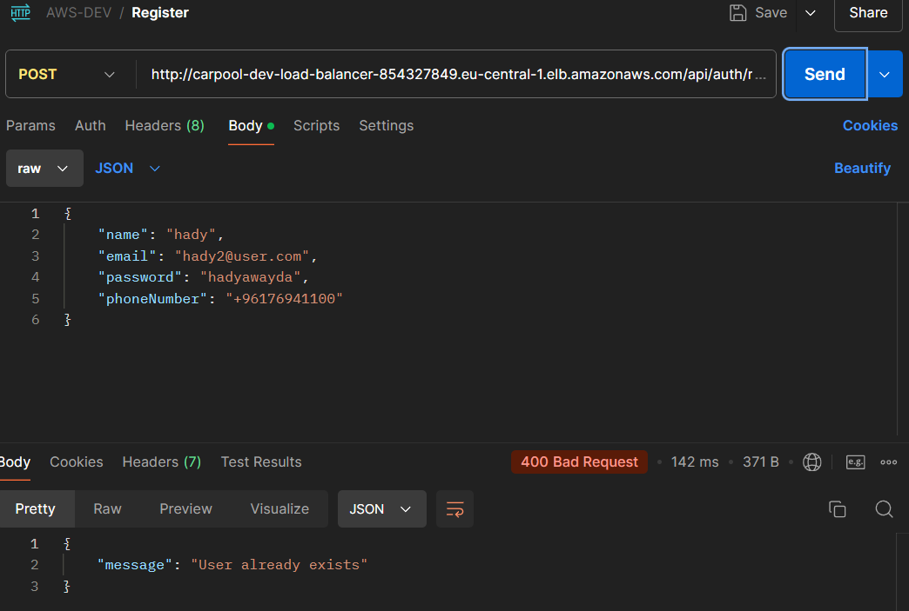      | 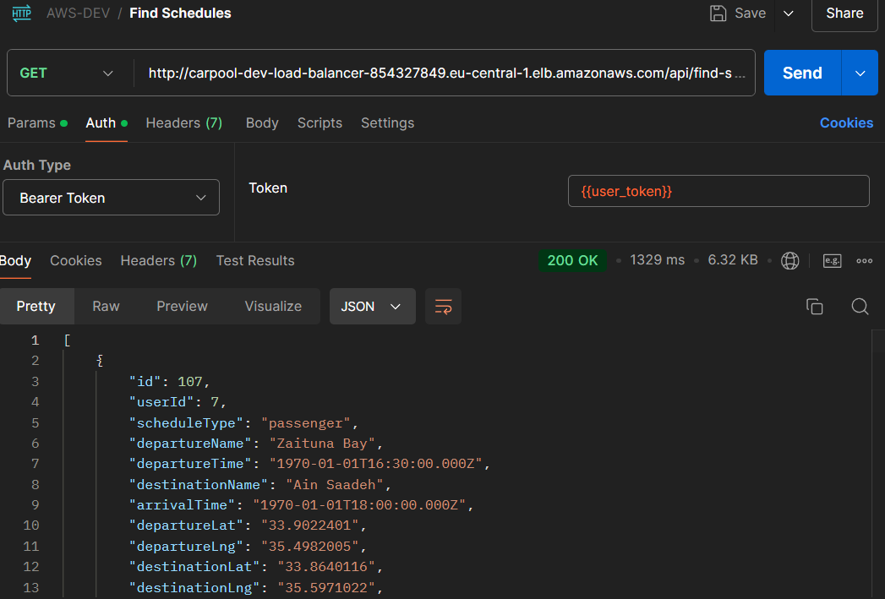    |

| Create User Schedule                          | Update User Schedule                          |
| ----------------------------------------------| --------------------------------------------- |
| 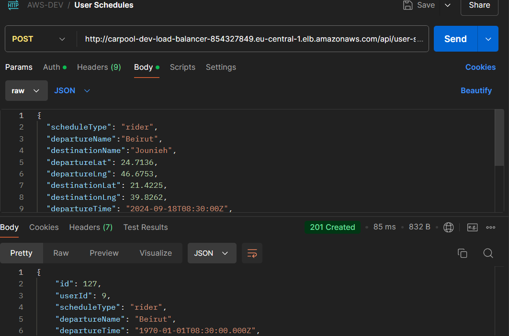    | 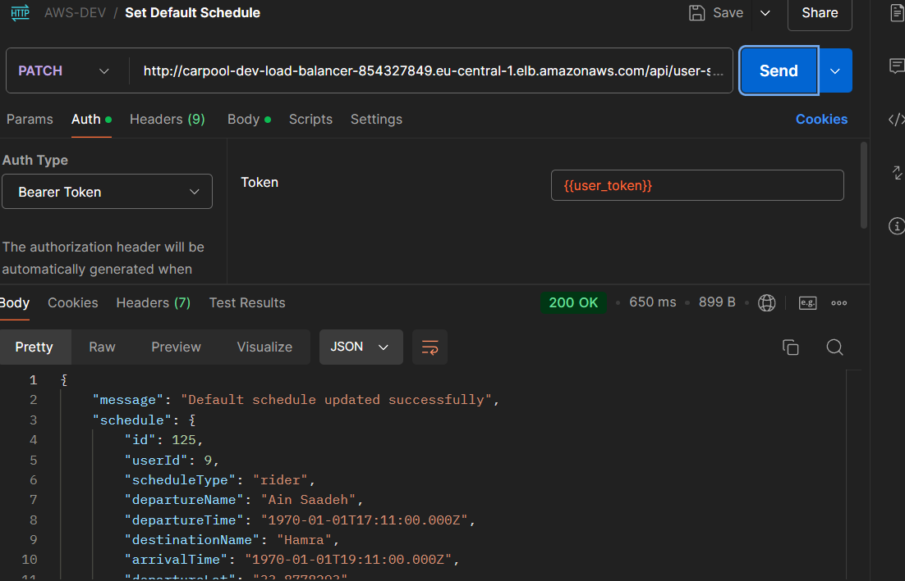    |
 
<br><br>

<!-- Unit Testing -->


### Precision in Development: Harnessing the Power of Unit Testing:

- This project employs rigorous unit testing methodologies to ensure the reliability and accuracy of code components. By systematically evaluating individual units of the software, we guarantee a robust foundation, identifying and addressing potential issues early in the development process.

<br><br>

<!-- How to run -->


> To set up Carpool Connect locally, follow these steps:

### Prerequisites

Download the Expo Go Application on your phone

### Installation

1. Clone the [github](https://github.com/hady-awayda/carpool-connect-frontend.git) repository
    ```sh
   git clone https://github.com/hady-awayda/carpool-connect-frontend.git carpool-connect
   ```
3. Go to the directory
    ```sh
   cd carpool-connect
   ```
4. Install NPM packages
   ```sh
   npm install
   ```
5. Download Expo Go Android Application
6. Run the local server
   ```js
   npx expo start -c
   ```
7. Scan the QR Code in the terminal with your phone camera

Now, you should be able to run Carpool Connect locally and explore its features.
